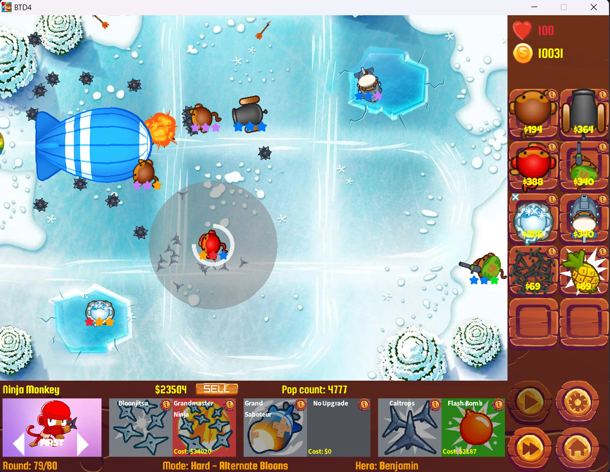

# CS202_BTD4
This project is a tower defense game using Raylib inspired by Bloons Tower Defense Series, a classic strategy game known for its addictive gameplay and progressive difficulty.  
  
In the game, the player must strategically place towers along a path to stop waves of enemies—balloons—from reaching the end. Each tower has unique abilities, upgrade options, and attack styles, offering players a variety of strategies to explore. The game aims to combine classic tower defense mechanics with fresh gameplay features and simple, clean visuals.

## Game Preview



## Build and Run
### Using build.bat:
Click at the build.bat in the folder `build`.

Just in case, this is the `build.bat`
```
@echo off
setlocal enabledelayedexpansion

:: Collect all .cpp files in src and subdirectories
set sources=
for /R ../src %%f in (*.cpp) do (
    set sources=!sources! "%%f"
)

:: Compile using g++
g++ !sources! -o Game.exe -O -I ../include/ -L ../lib/ -lraylib -lgdi32 -lwinmm

:: Run the game if compilation succeeds
if exist Game.exe (
    echo Running Game.exe...
    Game.exe
    pause
) else (
    echo Compilation failed. Game.exe not found.
    pause
)

:: Pause to see errors (if any)
:: pause
```

### Using CMake:
Follow the steps below to build and run:

```bash
# 1. Go to the build directory
cd build

# 2. Configure with CMake
cmake ..

# 3. Compile
cmake --build .

# 4. Run the executable
./game


