# UML Diagram Explanation
***
I’m not sure if I wrote this correctly, but I will try to explain everything based on the diagram.
This UML is specified for C++ and the external library **Raylib**.
***

## Interface Classes
These interface classes are designed for future expansion and modularity.

- Drawable: Defines objects that can be drawn on the screen.
- Updatable: Defines objects that update themselves during each game frame.

### Drawable
This interface ensures that all visual elements can be rendered on the screen.

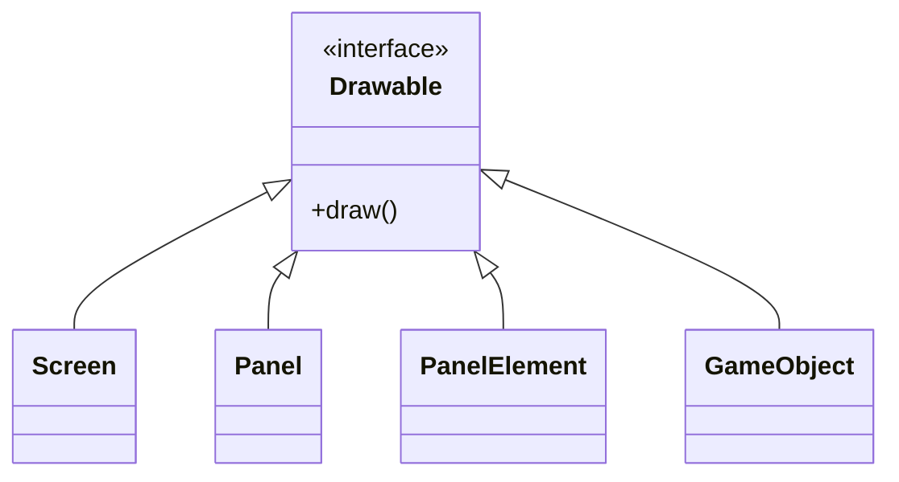
**Explanation:** 
- *Screen*: Represents different game screens, such as the main menu or gameplay.
- *Panel*: UI components within screens (e.g., settings panels, menus).
- *PanelElement*: Smaller UI elements like buttons and text fields.
- *GameObject*: Core objects in the game world (towers, enemies, bullets, etc.).

### Updatable
This interface allows game objects to update their state every frame.

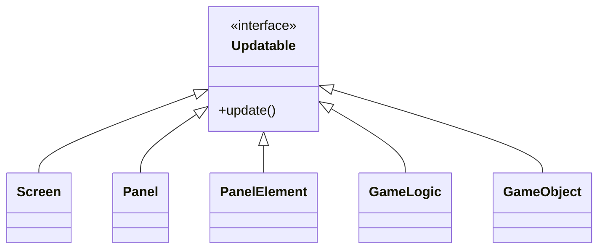
**Explanation:**
- *Screen*: Can update animations or handle screen transitions.
- *Panel*: Updates UI logic such as hover effects or panel animations.
- *PanelElement*: Updates for interactive elements (like buttons changing state).
- *GameLogic*: Updates core game logic (spawning, scoring, etc.).
- *GameObject*: Updates game world objects (movement, collisions, etc.).
***

## Core Classes
### Game
The main entry point of the game. It manages high-level systems:

- *GameLogic*: Core gameplay rules (towers, enemies, bullets).
- *InputManager*: Handles user input (mouse, keyboard).
- *SoundManager*: Controls sound and music.
- *ScreenManager*: Controls which screen is currently visible.
- *SpriteManager*: Manages loading and drawing of game sprites.
- *ScreenList*: Holds all available screens.

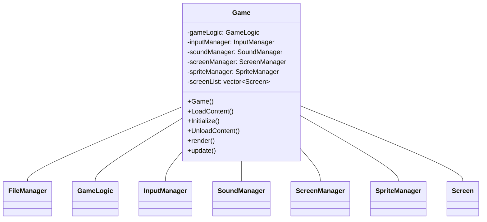
***

## Game Logic Subsystem
### GameLogic
Controls the main gameplay, including:

- *Levels*: Manages game levels.
- *Settings*: Game options such as resolution and sound.
- *LogicManager*: Manages specific game object types.

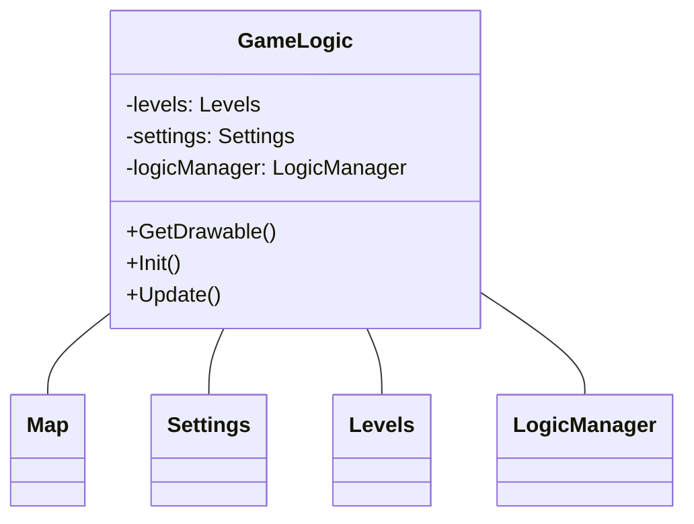

### LogicManager 
Handles the update and draw logic for different groups of game objects:

- *BulletManager*: Controls bullets.
- *EffectManager*: Manages effects like explosions.
- *EnemyManager*: Controls enemy movement and health.
- *TowerManager*: Handles towers and their behavior.

Each of these managers has its own list of objects (e.g., a vector\<Bullet\> for bullets).

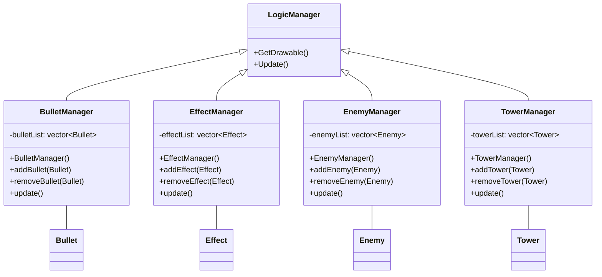
***

## Game Objects
### GameObject
Base class for all objects in the game world:

- *Bullet*: Fired from towers, moves toward enemies.
- *Effect*: Visuals like explosions.
- *Enemy*: The creeps that towers must destroy.
- *Tower*: The player's main defense structures.

Each subclass has its own attributes and methods:

- Bullets have damage, velocity, and hit()/miss() logic.
- Enemies have hp, reward, and die() logic.
- Towers can attack() enemies and upgrade().

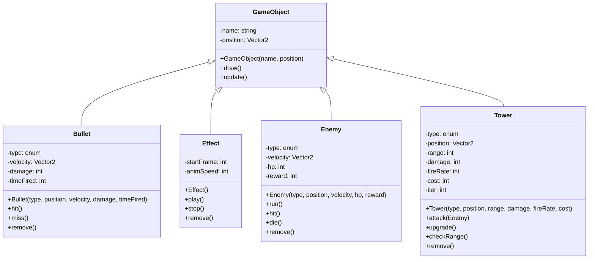
***

## User Interface System
### Screen
- Represents a full-screen UI, such as a menu or gameplay screen.
- Each Screen contains:
  - One or more Panels for organizing UI elements.
  - Panels contain PanelElements (buttons, text fields, input fields).

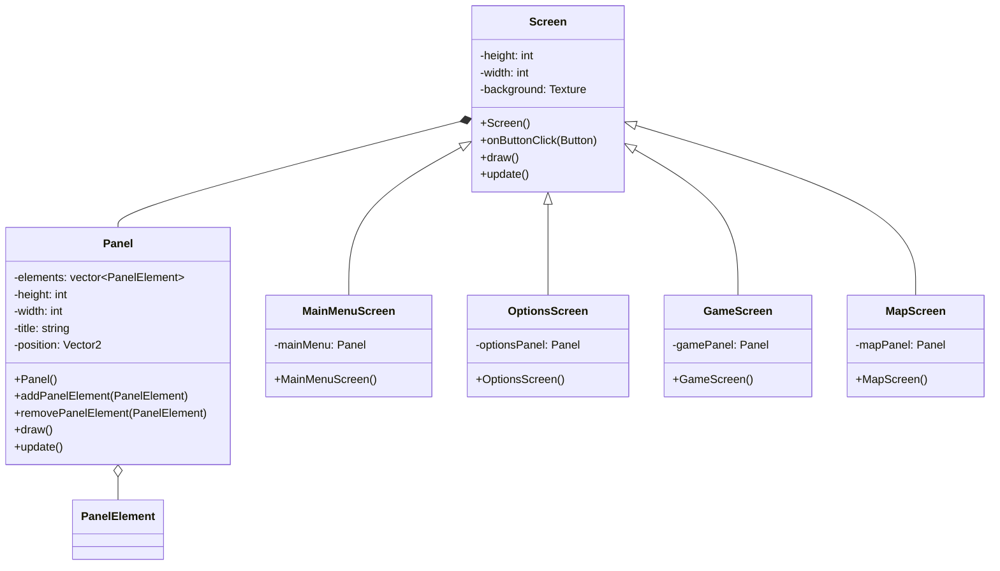

### PanelElement
Base class for UI components:

- *Button*: A clickable button.
- *TextureField*: Displays textures or images.
- *TextField*: Displays text.
- *InputField*: Lets players enter text.

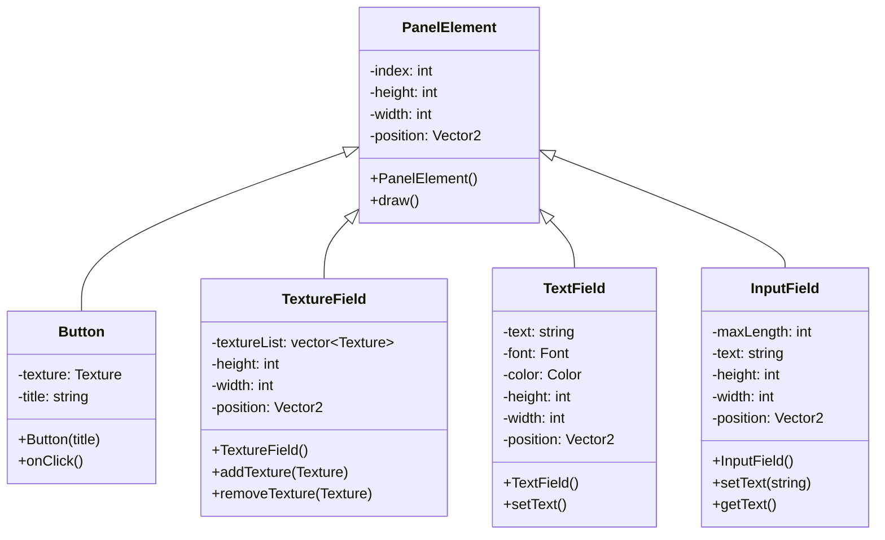
***

## Managers
### InputManager
Handles keyboard and mouse input:

- Tracks mouse position, clicks, and key presses.

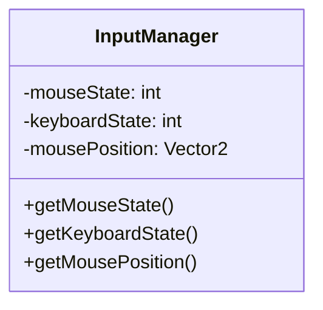

### SoundManager
Controls sound playback:

- Can play, stop, or mute sounds.
- Uses SoundChannels for categories (e.g., music, effects).

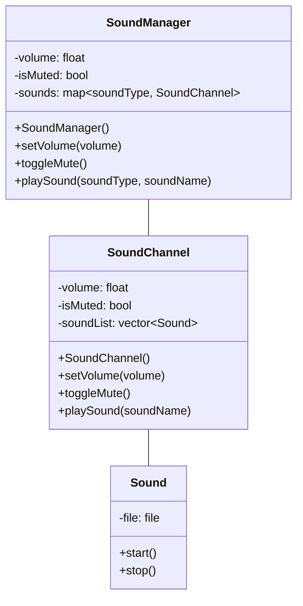

### FileManager
- Handles file import/export.
- Extended by EnemyImport, TowerImport, and MapImport to load specific game data.

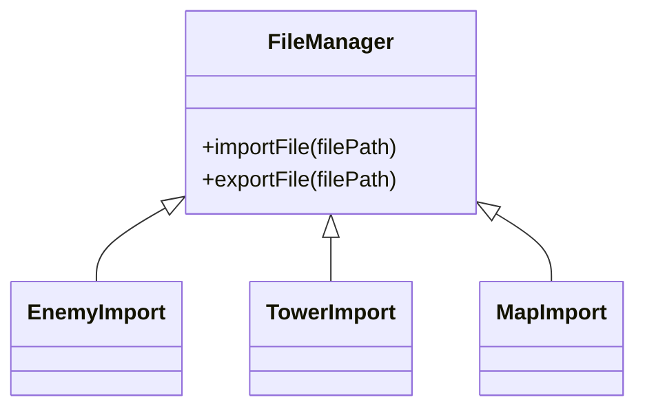
***

# Summary
This UML diagram outlines a modular architecture for a Tower Defense game:

- Interfaces define common behavior.
- Managers organize game components.
- The GameObject hierarchy handles core game logic.
- The UI system manages user interaction.

